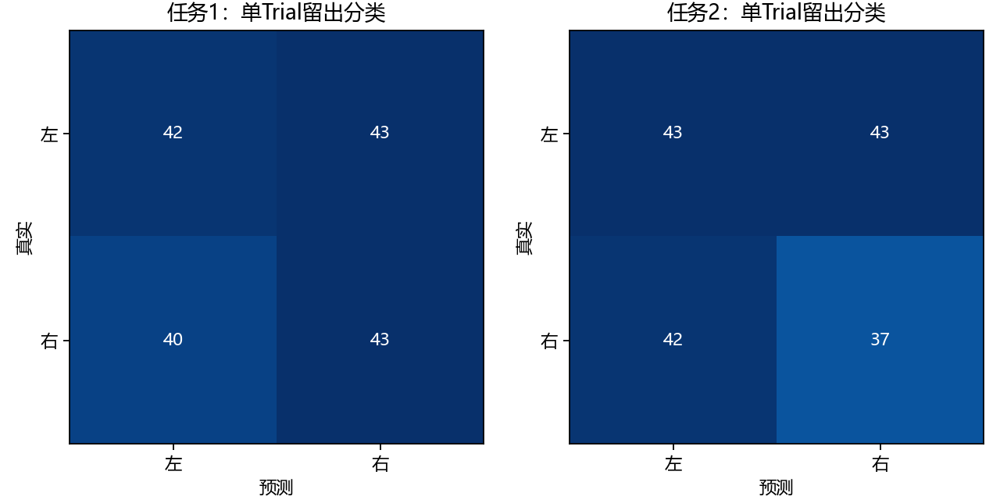
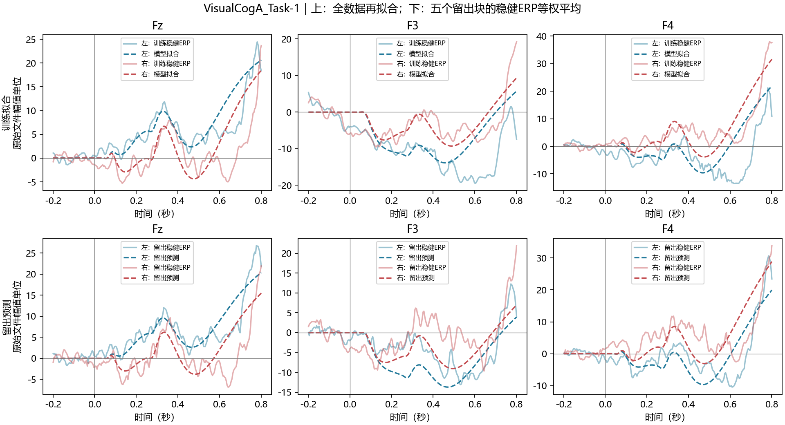
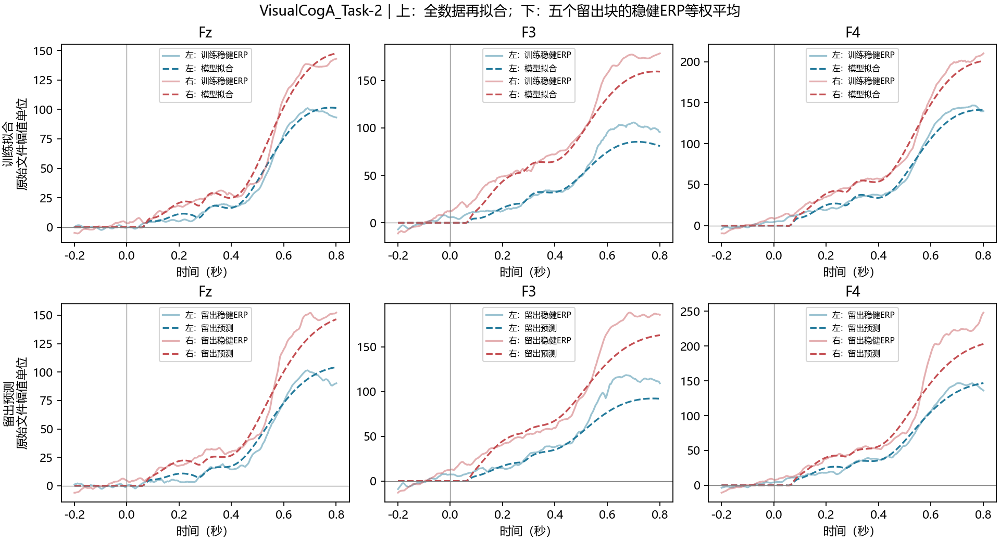
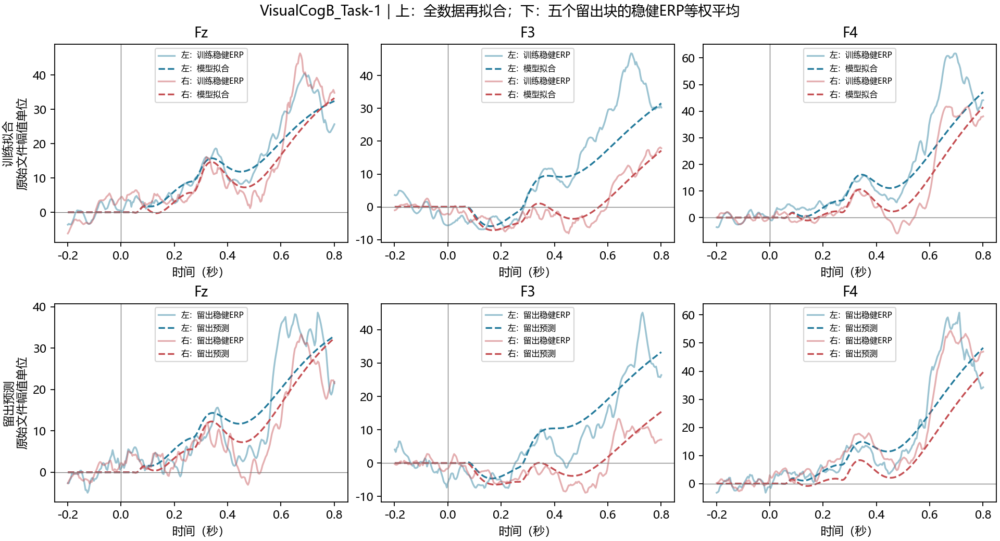
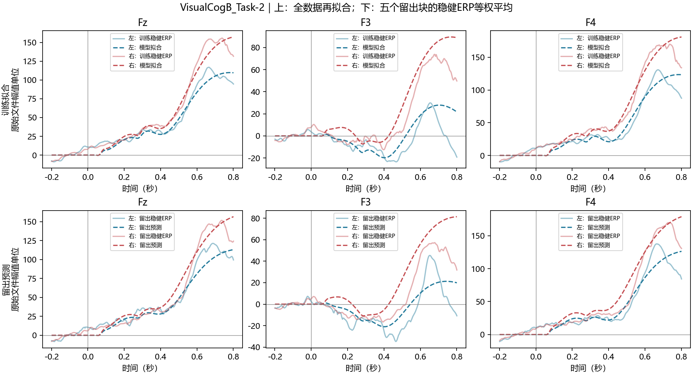
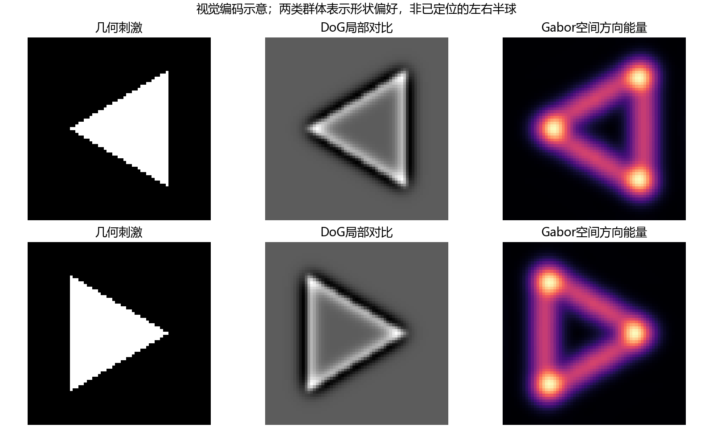

# 第二问结果报告

本项目仅保留一个主入口main.py。第一问程序和结果未修改；输入沿用30Hz低通、原始刺激前QC和基线规则，共333个有效Trial。
模型：空间方向编码 → 稳定Wilson–Cowan群体 → 因果记忆/持续状态 → 共同与形状差异观测 → 噪声加权时空特征。

## 三类效果必须分开理解

- 全数据训练稳健ERP的24条曲线汇总R²：**0.9382**；这是曲线拟合指标。
- 五折未见Trial的稳健ERP预测汇总R²：**0.2671**；汇总各折/记录SSE和SST，不把折当独立被试。
- 单Trial分类如下；曲线拟合良好不代表能可靠识别每个Trial。

|任务|原主版BA|当前主流程BA|95%时间块条件区间|
|---|---:|---:|---|
|1|0.5186|0.5061|[0.4460, 0.5721]|
|2|0.4943|0.4842|[0.4097, 0.5460]|

条件区间仅对固定OOF预测做记录内时间块bootstrap1000次，不包括全流程重新训练。主流程由内层选择；不从外层消融中挑最高值替换主成绩。

|任务|完整分类流程置换次数|单侧探索性p值|
|---|---:|---:|
|1|19|0.3|
|2|19|0.75|

置换在同记录同时间块内交换有效Trial标签，重新计算ERP、差异模板、类内噪声协方差、内层分类选择和最终分类器。波形专用参数不进入分类，因此不在分类置换中重复无关的波形选参。19次p值分辨率0.05，块内可交换性未由实验元数据独立确认。

## 曲线拟合明细

|记录|方向|电极|训练R²|训练RMSE|
|---|---|---|---:|---:|
|VisualCogA_Task-1|左|Fz|0.5788|3.331|
|VisualCogA_Task-1|左|F3|-0.6088|6.740|
|VisualCogA_Task-1|左|F4|-0.2867|7.793|
|VisualCogA_Task-1|右|Fz|-0.1055|5.102|
|VisualCogA_Task-1|右|F3|0.4238|4.134|
|VisualCogA_Task-1|右|F4|0.5928|5.279|
|VisualCogA_Task-2|左|Fz|0.9886|3.966|
|VisualCogA_Task-2|左|F3|0.9166|10.570|
|VisualCogA_Task-2|左|F4|0.9863|5.870|
|VisualCogA_Task-2|右|Fz|0.9843|6.209|
|VisualCogA_Task-2|右|F3|0.9347|14.271|
|VisualCogA_Task-2|右|F4|0.9867|7.841|
|VisualCogB_Task-1|左|Fz|0.8366|4.680|
|VisualCogB_Task-1|左|F3|0.7862|7.688|
|VisualCogB_Task-1|左|F4|0.7711|9.198|
|VisualCogB_Task-1|右|Fz|0.7706|6.377|
|VisualCogB_Task-1|右|F3|0.8964|2.351|
|VisualCogB_Task-1|右|F4|0.8594|5.809|
|VisualCogB_Task-2|左|Fz|0.9527|7.793|
|VisualCogB_Task-2|左|F3|0.0745|12.518|
|VisualCogB_Task-2|左|F4|0.9194|11.007|
|VisualCogB_Task-2|右|Fz|0.9735|8.529|
|VisualCogB_Task-2|右|F3|0.7737|13.940|
|VisualCogB_Task-2|右|F4|0.9556|11.964|

## 留出单Trial波形对照

|记录|原模型0–500ms R²|当前模型0–500ms R²|当前模型0–800ms R²|
|---|---:|---:|---:|
|VisualCogA_Task-1|-0.0111|-0.0112|-0.0157|
|VisualCogA_Task-2|-0.0156|0.0210|0.0916|
|VisualCogB_Task-1|-0.0071|-0.0062|0.0014|
|VisualCogB_Task-2|-0.0014|0.0005|0.0498|

当前模型用完整0–800ms训练响应，原模型只拟合0–500ms，因此本表比较的是整个流程改动，不是只更换一项参数的因果消融。保留所有负R²；单Trial评分未降权困难测试样本。
留出ERP的目标用留出组内QC×Huber估计，只用于评分；其QC尺度来自训练块。它与原始等权单Trial指标不同。

## 参数与可辨识性

原时间常数拟合反复触界，本版固定τE=60ms、τI=120ms、延迟70ms、任务增益1；不再声称估计出真实突触时间常数或任务2生理增益。每种共同/差异响应使用6个固定因果基底。
全数据展示模型的Ridge=0.0001，记录收缩=1.0；名义系数144个，条件线性有效自由度约73.76。有效自由度未包含ERP估计和调参复杂度。
每条记录的左右响应共用共同系数和差异系数，通过同一形状符号正负变化产生。记录系数向同任务均值收缩；差异部分的Ridge是共同部分的10倍，防止把微弱差波过拟合。
完整波形正则由内层共同/差异误差选择。分类特征使用固定Ridge=0.01、收缩=0.1的模型，避免波形调参越过分类内层边界。
先从训练类内残差估计Ledoit–Wolf协方差，再计算差异模板的噪声加权投影；未分别把左右模板压成单位范数。候选为4幅值、24时空均值、24时空均值+差异分数，三种LR正则和一个收缩LDA对照。

## 文件与适用边界

- oof_predictions.csv：每个有效Trial只在外层测试一次；classifier_selection.json记录内层选择。
- curve_fit_metrics.csv和fitted_curves.npz：全数据训练拟合；erp_validation.csv：留出稳健ERP评分。
- waveform_metrics.csv和heldout_waveforms.npz：单Trial原幅值预测，含共同响应和训练ERP消融。
- final_model.json供predict.py使用；预测输入不接受真实标签，但需要已校准的记录标识。新记录需另行校准。
- 本轮在先前已查看的数据上探索，不能把这333个Trial当新增独立测试集。不同记录不等于已确认的不同被试。
- 只有三个额区通道，无独立眼电和头模型；形状选择性群体不表示左右半球，不作真实脑源定位。
- 零相位滤波使用完整扩展窗，分类特征截止500ms不等于500ms在线实时决策。
- 第一问处理结果不参与本次模型重写；分类接近机会水平时照实报告，不能由训练曲线的高R²替代证据。
